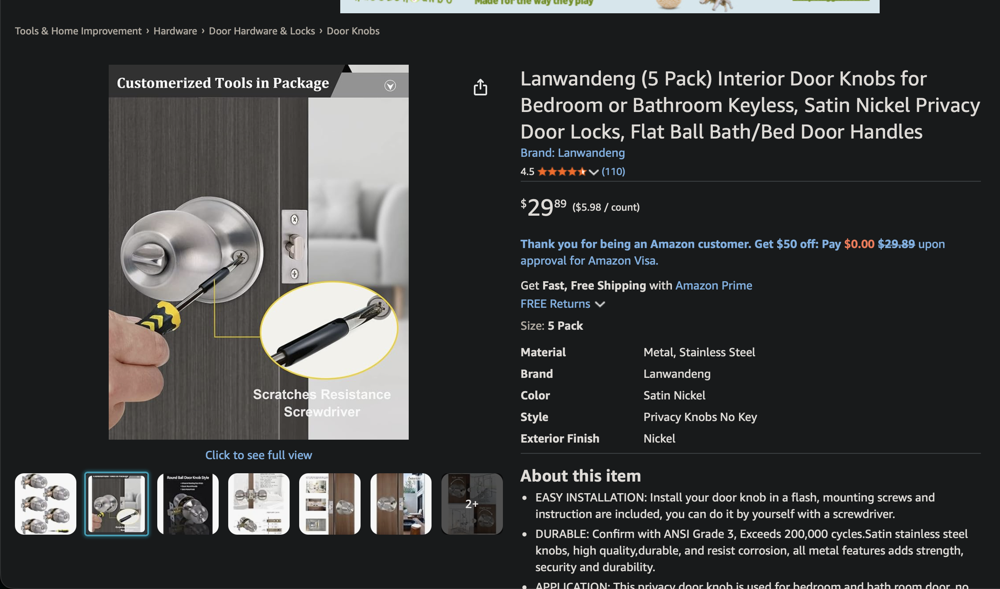
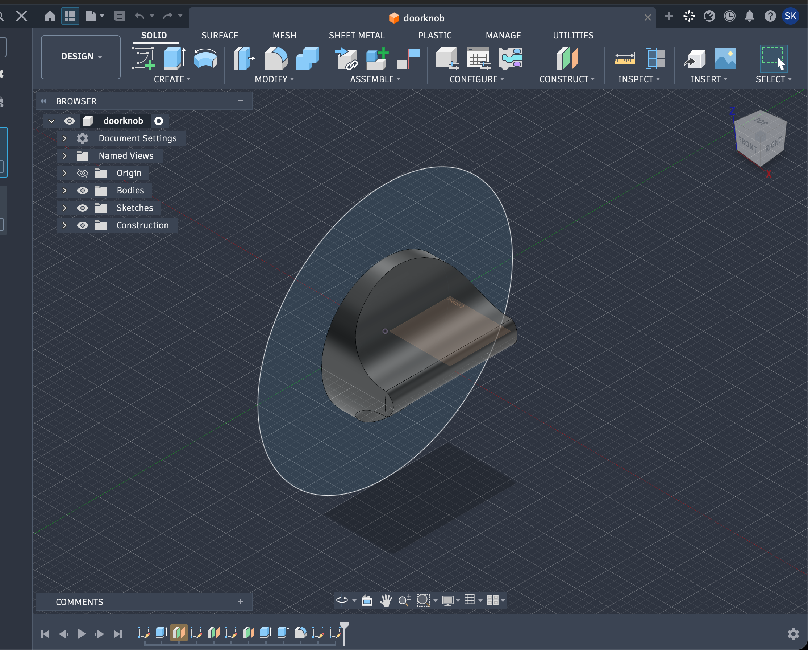

# September 28: Got my rough sketch of what I want to do

Today, I drafted my plan. I plan on using an esp32 and program it through esp-home. I will link esp-home to apple home through home assistant. I will need a raspberry pi 4 or something along those lines to host my home assistant. I plan on using a simple servo to turn the lock on my room. A flaw that I found in the lock in my room was that you could just unlock with fingernails. My parents do this a LOT and this is my main reason for making this specifically. I should be able to have the servo turn the lock directly but it still could be easily picked. I need to think about what I should do for my motor placement, I could incorporate a couple gears that I would need help printing out.

**Total time spent: 2 hours**

# September 29: Get parts list together

Today, I am getting together my parts list!

    - esp-32 ESP32 NodeMCU(https://www.waveshare.com/nodemcu-32s.htm?srsltid=AU7gw4WxtxinVNuGE91ZI9bvknZxS7t40JB4JxLVvDvFc5UCUZIBqMdF)
    - Any servo will probably work, if want it specifically, I would say the MG90S Micro Servo(https://www.waveshare.com/mg90s-servo.htm?srsltid=AU7gw4W-WUjIAndyMaUyDKGfsKIQHCl-wtZno2RkDAJsOc4ghldiOVRNl28)
    - NFC sticker(https://www.amazon.com/NFC-Stickers-Rewritable-Adhesive-Automatically/dp/B0G8T84TCF?th=1)
    - NFC reader PN532(https://us.amazon.com/HiLetgo-Communication-Arduino-Raspberry-Android/dp/B01I1J17LC?th=1)
    - 5V power supply for servo
    - I don't need a raspberry pi 4B now because I just got my own so I can host everything.
    - I have access to a 3d printer at my local ftc team, so I will not need anything printed

1

**Total time spent: 3 hours** 

# October 3: Finding stl of my door knob
    I spent WAY too long trying to find my exact door model, but after a while I did, but you know what, the seller DOESN'T have any files in it(https://www.amazon.com/dp/B09XHF8HBH?plpRedirect=mhFallback&ref=clp_hp_h_pc&th=1):sob:, and I did SO much research that I came across ANOTHER video that was trying to find THEIR doorknob and I saw that they just used polyscan on their phone to just get it that way, so that is what I did(took SIX times btw) and still NONE of them worked because it's reflective :sob:.

**Total time spent: 5 hours**

# October 4: Modeling the door knob myself
    Today I was able to model the lock portion of my doorknob, I didn't have a caliper so I just used some measuring tape. This is my progress so far!
    

**Total time spend: 2 hours**